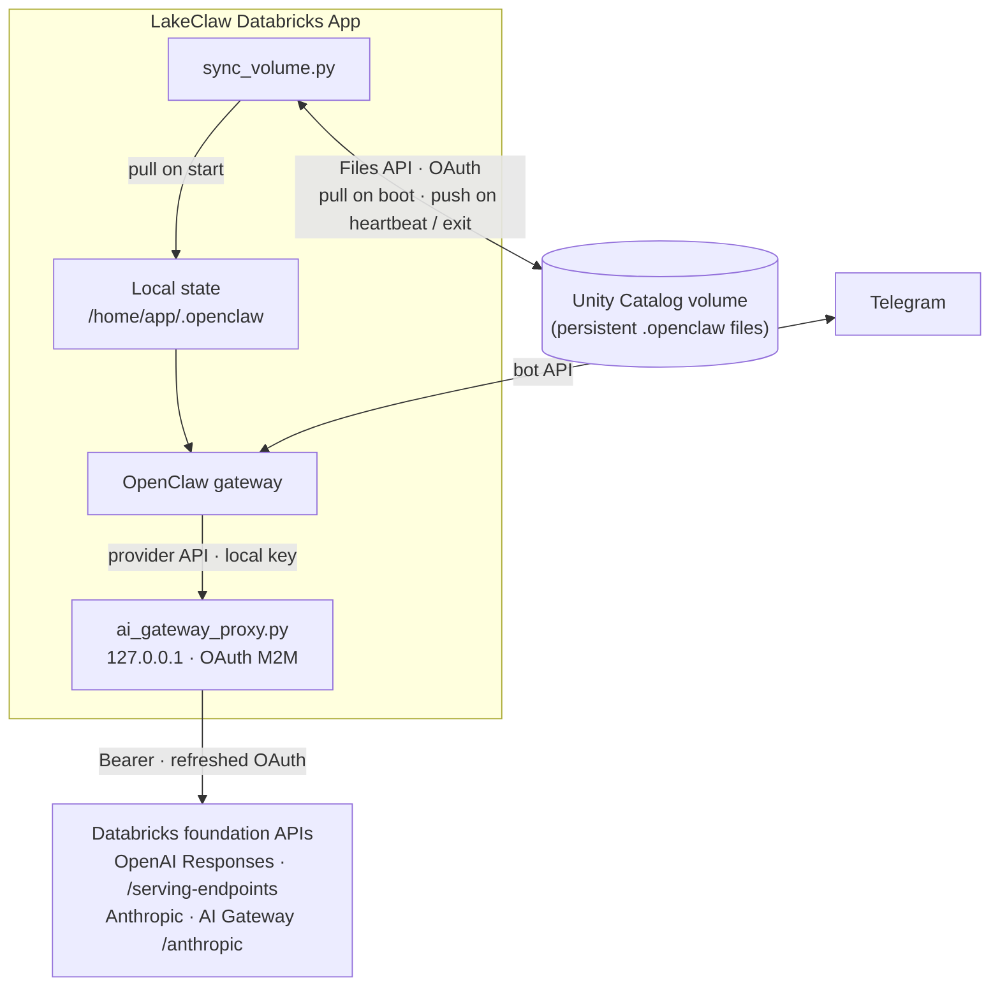

# LakeClaw

Most interactions within Databricks are ephemeral. You open a notebook, ask Genie a question, and get an answer, but the "intelligence" is scattered. It feels like hiring a brilliant consultant who forgets everything the moment they leave the room. Even with powerful built-in assistants, there is a fundamental lack of a persistent agent—one that is "always on," evolves as your data grows, and possesses the architectural "soul" that a project like OpenClaw provides. 

LakeClaw was built to fill this gap. By porting the [OpenClaw](https://github.com/openclaw) framework to Databricks Apps, we've created an agent that doesn't just run on the lake; it lives there. It's a freshwater crustacean designed to thrive in the Databricks ecosystem, using the Lakehouse as its long-term memory and its primary sensory input.

## Architecture

There are **two parallel paths**: (1) chat traffic goes through the gateway to the model, and (2) agent state is copied between the container disk and a UC volume so restarts do not wipe memory.



**Startup order:** `entrypoint.sh` creates `OPENCLAW_STATE_DIR`, symlinks `openclaw.json`, runs **`sync_volume.py` pull** from the volume, starts **`ai_gateway_proxy.py`** (waits for `/healthz`), then **`npm start`** (`openclaw gateway run` on `DATABRICKS_APP_PORT`). Pushes run on a **heartbeat** and on **SIGTERM/SIGINT**.

**Auth split:** OpenClaw calls **`ai_gateway_proxy.py`** on loopback with a static `AI_GATEWAY_PROXY_LOCAL_KEY`. The proxy exchanges **`DATABRICKS_CLIENT_ID` / `DATABRICKS_CLIENT_SECRET`** for workspace OAuth tokens (`/oidc/v1/token`), refreshes before expiry, and forwards with `Authorization: Bearer <access_token>`. **Path-based upstream:** requests under **`/serving-endpoints`** go to **`https://<DATABRICKS_HOST>`** (pay-per-token [OpenAI Responses API](https://docs.databricks.com/aws/en/machine-learning/model-serving/query-openai-responses)); other prefixes (e.g. **`/anthropic`**) go to **AI Gateway** (`https://<workspace-id>.ai-gateway.cloud.databricks.com`). Volume sync uses the same OAuth via `WorkspaceClient` (it temporarily unsets `DATABRICKS_TOKEN` while constructing the client so the SDK does not see conflicting auth).

**Bundled behavior (see `openclaw.json`):** default model is `databricks-openai/databricks-gpt-5-4` using the **OpenAI Responses** surface at **`/serving-endpoints`** (workspace host via proxy). **Anthropic Messages** models are under `databricks-anthropic/*` (same proxy, `api: anthropic-messages`, path `/anthropic` → AI Gateway). **Google Gemini** pay-per-token models are under `databricks-gemini/*` (`api: google-generative-ai`, base **`/serving-endpoints/gemini`** per [Databricks Gemini API](https://docs.databricks.com/aws/en/machine-learning/model-serving/query-gemini-api)). Telegram uses an allowlist (`TELEGRAM_ALLOWED_USER_ID`); gateway auth is token-based (`OPENCLAW_GATEWAY_TOKEN`); the `databricks-unity-catalog` skill is enabled; extra skills can be loaded from `.openclaw/workspace/skills` on the volume after sync.

## Project Structure

```
lakeclaw/
├── databricks.yml              # Bundle: app resource, secrets, UC volume binding, targets
├── README.md
├── app.yaml                    # App command (entrypoint.sh) and env → secret/volume mapping
├── openclaw.json               # OpenClaw config (models, Telegram, gateway auth, skills)
├── entrypoint.sh               # Sets OPENCLAW_* paths, AI proxy env, initial pull, heartbeat, npm start
├── ai_gateway_proxy.py         # Loopback proxy: OAuth M2M → serving-endpoints or AI Gateway by path
├── requirements.txt            # Python deps (SDK, httpx, Starlette, uvicorn)
├── sync_volume.py              # UC Files API sync via OAuth WorkspaceClient; push/pull .openclaw state
└── package.json                # openclaw CLI; start script uses DATABRICKS_APP_PORT
```

## Prerequisites

- [Databricks CLI](https://docs.databricks.com/dev-tools/cli/index.html) with bundle support (0.200+; project tested with recent CLI releases)
- A Databricks workspace with [Apps](https://docs.databricks.com/en/dev-tools/databricks-apps/index.html) enabled
- A Unity Catalog volume for state persistence (create empty or seed with prior `.openclaw` content)
- A Databricks secret scope holding the keys referenced by the bundle (see below)
- **Foundation models:** the app must reach **`DATABRICKS_HOST`** for **`/serving-endpoints`** (OpenAI Responses pay-per-token) and **AI Gateway** for **`/anthropic`**. OpenClaw uses the **local proxy** (`http://127.0.0.1:${AI_GATEWAY_PROXY_PORT}/serving-endpoints` for OpenAI, same port + `/anthropic` for Anthropic); the proxy attaches OAuth. See [OpenAI Responses on Databricks](https://docs.databricks.com/aws/en/machine-learning/model-serving/query-openai-responses).

## Secrets Setup

Create the secret scope and populate the required secrets. This is a one-time setup:

```bash
databricks secrets create-scope lakeclaw
databricks secrets put-secret lakeclaw gateway-passphrase
databricks secrets put-secret lakeclaw telegram-bot-token
databricks secrets put-secret lakeclaw databricks-token
```

| Secret key (in scope)   | Injected as / used for |
| ----------------------- | ---------------------- |
| `gateway-passphrase`    | `OPENCLAW_GATEWAY_TOKEN` — gateway HTTP auth (`openclaw.json` `gateway.auth.token`) |
| `telegram-bot-token`    | `TELEGRAM_BOT_TOKEN` |
| `databricks-token`      | `DATABRICKS_TOKEN` — optional PAT still injected if present; **default model traffic** uses OAuth via `ai_gateway_proxy.py`, not `openclaw.json` + PAT. Not used by `sync_volume.py` (OAuth only there). |

**Volume sync env vars:** `sync_volume.py` reads `DATABRICKS_HOST`, `DATABRICKS_CLIENT_ID`, and `DATABRICKS_CLIENT_SECRET` for OAuth. Databricks Apps often provide these for the app’s service principal; if they are missing, configure them (or equivalent app identity) so the Files API can read and write the bound UC volume. Grant that identity **WRITE** on the volume in Unity Catalog.

**Telegram allowlist:** `openclaw.json` sets `dmPolicy` to `allowlist` and reads `TELEGRAM_ALLOWED_USER_ID`. That value is set in `app.yaml` (currently a literal); change it there (or switch to a secret) for your Telegram user ID.

## Configuration

The bundle uses variables that can be overridden per target or at deploy time:

| Variable           | Default                                      | Description |
| ------------------ | -------------------------------------------- | ----------- |
| `secret_scope`     | `lakeclaw`                                   | Secret scope name used by app resources |
| `lakeclaw_volume`  | `/Volumes/catalog/schema/lakeclaw_volume`    | UC volume **path** (must match how you created the volume) |

Update the defaults in `databricks.yml` or override at deploy time:

```bash
databricks bundle deploy -var='lakeclaw_volume=/Volumes/my_catalog/my_schema/lakeclaw_volume'
```

## Deployment

### Validate

```bash
databricks bundle validate
```

### Deploy

```bash
# Deploy to dev (default target)
databricks bundle deploy

# Deploy to production
databricks bundle deploy -t prod
```

### Start the App

Deploying the bundle creates the app resource but does not start it. To start:

```bash
databricks bundle run lakeclaw_app
```

### View logs

```bash
databricks apps logs lakeclaw-dev
```

Use `lakeclaw-prod` when deployed to the `prod` target. Adjust if you change app names in `databricks.yml`.

### Tear Down

```bash
databricks bundle destroy
```

## State persistence

OpenClaw state lives under `/home/app/.openclaw` (`OPENCLAW_STATE_DIR`). The volume path comes from the app resource `lakeclaw-volume` (Unity Catalog), exposed to the container as `MY_UC_VOLUME_PATH`.

`sync_volume.py` behavior:

1. **On startup (before gateway)** — recursively downloads the volume tree into `/home/app`, preserving paths under `.openclaw/` (and other paths relative to `APP_HOME`).
2. **Every hour** — background loop in `entrypoint.sh` runs `sync_volume.py --push`.
3. **On shutdown** — `SIGTERM` / `SIGINT` runs a final `sync_volume.py --push`.

**Push rules:** uploads files under `.openclaw` with extensions `.md`, `.json`, `.jsonl`, `.db`, `.key`, `.yaml`. Skips `openclaw.json` and symlinks (the bundled config is symlinked from `/app/python/source_code` and should not be written back as content).

**Client:** `sync_volume.py` builds `WorkspaceClient()` with app-injected OAuth env vars so volume operations use **OAuth machine-to-machine** credentials. OpenClaw model calls go to **`ai_gateway_proxy.py`**, which uses **OAuth M2M** toward **`/serving-endpoints`** on the workspace host or toward **AI Gateway** for `/anthropic` (SSE transport is forced in `openclaw.json` so the proxy stays HTTP-only).

## Targets

| Target | Mode          | App name        | Notes |
| ------ | ------------- | --------------- | ----- |
| `dev`  | `development` | `lakeclaw-dev`  | Default target |
| `prod` | `production`  | `lakeclaw-prod` | `databricks.yml` grants `CAN_MANAGE` on the app to `${DATABRICKS_CLIENT_ID}` (set in your deploy environment when using this block) |
