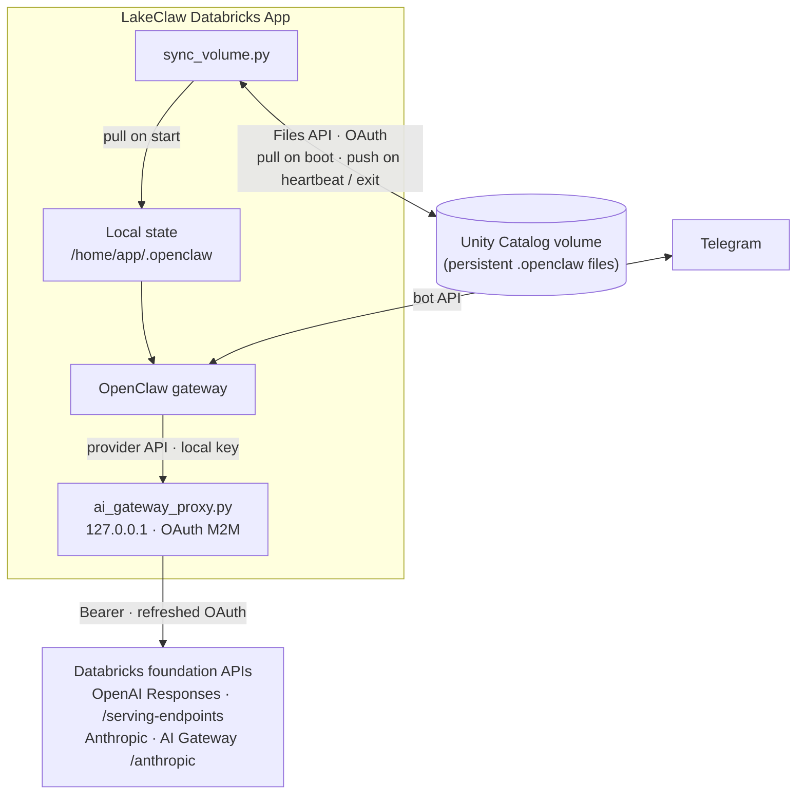

# LakeClaw


**LakeClaw** runs [OpenClaw](https://github.com/openclaw) on [Databricks Apps](https://docs.databricks.com/en/dev-tools/databricks-apps/index.html): a persistent agent on the lakehouse with Telegram as one interface, Unity Catalog for long-lived state, and Databricks foundation models behind a local OAuth proxy.

## Architecture

Chat flows through the OpenClaw gateway to **`app/ai_gateway_proxy.py`** (loopback); model traffic uses OAuth M2M to **`/serving-endpoints`** and **AI Gateway** (`/anthropic`). **`app/sync_volume.py`** pulls OpenClaw state from a UC volume on boot and pushes on a timer and shutdown so restarts do not wipe memory.



**Boot order:** `app/entrypoint.sh` prepares state dir and config symlink → **`sync_volume.py` pull** → **`ai_gateway_proxy.py`** (until `/healthz`) → **`npm start`** (gateway on `DATABRICKS_APP_PORT`). For auth and model routing details, see `app/ai_gateway_proxy.py`, `app/openclaw.json`, and `app/entrypoint.sh`.

## Prerequisites

- [Databricks CLI](https://docs.databricks.com/dev-tools/cli/index.html) **0.200+** with bundle support; authenticate with `databricks auth login` (or a profile) to a workspace that has **Databricks Apps** enabled.
- A **Unity Catalog volume** for OpenClaw state (empty is fine) and **WRITE** on that volume for the **App service principal** (OAuth / Files API identity used by `app/sync_volume.py`). Grant after you know the principal if needed, before relying on sync at boot.
- A **secret scope** (default name `lakeclaw`, overridable via `secret_scope` in `databricks.yml`) with two keys — see [Secrets and configuration](#secrets-and-configuration).
- **Network / product access:** the app reaches workspace **`DATABRICKS_HOST`** for **`/serving-endpoints`** and **AI Gateway** for Anthropic paths. See [OpenAI Responses on Databricks](https://docs.databricks.com/aws/en/machine-learning/model-serving/query-openai-responses).
- **OAuth env for the app:** `DATABRICKS_HOST`, `DATABRICKS_CLIENT_ID`, `DATABRICKS_CLIENT_SECRET` for the proxy and volume sync (Apps usually inject these; configure the app identity if not).

## Quick start

Do this **once per workspace** (or environment). The bundle cannot create secret values for you.

1. **Volume** — Create the UC volume; note its full path (e.g. `/Volumes/cat/schema/lakeclaw_volume`).
2. **Bundle** — Set `lakeclaw_volume` in `databricks.yml` **or** pass `-var='lakeclaw_volume=...'` on deploy.
3. **Secrets** — Create scope and keys (`gateway-passphrase`, `telegram-bot-token`); see commands and table below.
4. **Telegram allowlist** — After clone or install, edit **`app.yaml`**: replace the placeholder `YOUR_TELEGRAM_USER_ID` under `TELEGRAM_ALLOWED_USER_ID` with your numeric Telegram user ID (e.g. from [@userinfobot](https://t.me/userinfobot)), then redeploy. `app/openclaw.json` uses `${TELEGRAM_ALLOWED_USER_ID}` in `channels.telegram.allowFrom`.

From the repo root:

```bash
databricks bundle validate && databricks bundle deploy && databricks bundle run lakeclaw_app
```

With an inline volume override (if you did not edit defaults in `databricks.yml`):

```bash
databricks bundle validate && databricks bundle deploy -var='lakeclaw_volume=/Volumes/my_catalog/my_schema/lakeclaw_volume' && databricks bundle run lakeclaw_app
```

**Deploy** registers the app; **`databricks bundle run lakeclaw_app`** starts it. Logs: `databricks apps logs lakeclaw-dev` (use `lakeclaw-prod` after `databricks bundle deploy -t prod`).

## Project structure

```
lakeclaw/
├── databricks.yml              # Bundle: app resource, secrets, UC volume, targets
├── app.yaml                    # Command + env → secrets / volume
├── package.json                # openclaw CLI; gateway uses DATABRICKS_APP_PORT
├── requirements.txt
└── app/                        # Runnable app tree (all paths under one folder)
    ├── entrypoint.sh           # State dir, pull, proxy, heartbeat, gateway
    ├── openclaw.json           # Models, Telegram, gateway, skills
    ├── ai_gateway_proxy.py     # Loopback OAuth proxy → serving-endpoints / AI Gateway
    ├── sync_volume.py          # UC Files API pull/push for .openclaw state
    └── assets/
        └── lakeclaw-lakehouse-no-bg.png
```

## Secrets and configuration

**Secret scope (one-time):**

```bash
databricks secrets create-scope lakeclaw
databricks secrets put-secret lakeclaw gateway-passphrase
databricks secrets put-secret lakeclaw telegram-bot-token
```


| Secret key           | Role                                                                                    |
| -------------------- | --------------------------------------------------------------------------------------- |
| `gateway-passphrase` | Becomes `OPENCLAW_GATEWAY_TOKEN` (gateway HTTP auth; aligns with `app/openclaw.json`). |
| `telegram-bot-token` | `TELEGRAM_BOT_TOKEN`.                                                                   |

The app does not inject a workspace PAT: model calls use OAuth via `app/ai_gateway_proxy.py`, and `app/sync_volume.py` uses OAuth for the Files API.

**Bundle variables** (`databricks.yml` or `-var` on deploy):


| Variable          | Default                                   | Purpose                                                              |
| ----------------- | ----------------------------------------- | -------------------------------------------------------------------- |
| `secret_scope`    | `lakeclaw`                                | Databricks secret scope name bound to the app.                       |
| `lakeclaw_volume` | `/Volumes/catalog/schema/lakeclaw_volume` | UC volume full path; must exist and allow the app identity to write. |


Example deploy with only the volume overridden:

```bash
databricks bundle deploy -var='lakeclaw_volume=/Volumes/my_catalog/my_schema/lakeclaw_volume'
```

## Deploy and operate


| Action                                | Command                                                |
| ------------------------------------- | ------------------------------------------------------ |
| Validate                              | `databricks bundle validate`                           |
| Deploy (default `dev` target)         | `databricks bundle deploy`                             |
| Deploy production                     | `databricks bundle deploy -t prod`                     |
| **Start app** (required after deploy) | `databricks bundle run lakeclaw_app`                   |
| Logs                                  | `databricks apps logs lakeclaw-dev` or `lakeclaw-prod` |
| Tear down                             | `databricks bundle destroy`                            |


## State persistence

OpenClaw state lives under `/home/app/.openclaw` (`OPENCLAW_STATE_DIR`). The bound UC volume is exposed as `MY_UC_VOLUME_PATH`.

- **Startup** — `app/sync_volume.py` pulls from the volume into the app home before the gateway starts.
- **Ongoing** — `app/entrypoint.sh` runs a periodic push; **shutdown** runs a final push.
- **Push** — Files under `.openclaw` with extensions `.md`, `.json`, `.jsonl`, `.db`, `.key`, `.yaml`. Skips `openclaw.json` and symlinks so the bundled config is not written back as content.

Model transport and Gemini path behavior are defined in `app/openclaw.json` and `app/ai_gateway_proxy.py`.

## Bundle targets


| Target | Mode        | App name        | Notes                                                                                                                                |
| ------ | ----------- | --------------- | ------------------------------------------------------------------------------------------------------------------------------------ |
| `dev`  | development | `lakeclaw-dev`  | Default                                                                                                                              |
| `prod` | production  | `lakeclaw-prod` | `databricks.yml` grants `CAN_MANAGE` to `${DATABRICKS_CLIENT_ID}` for the prod block — set in your deploy environment when using it. |
