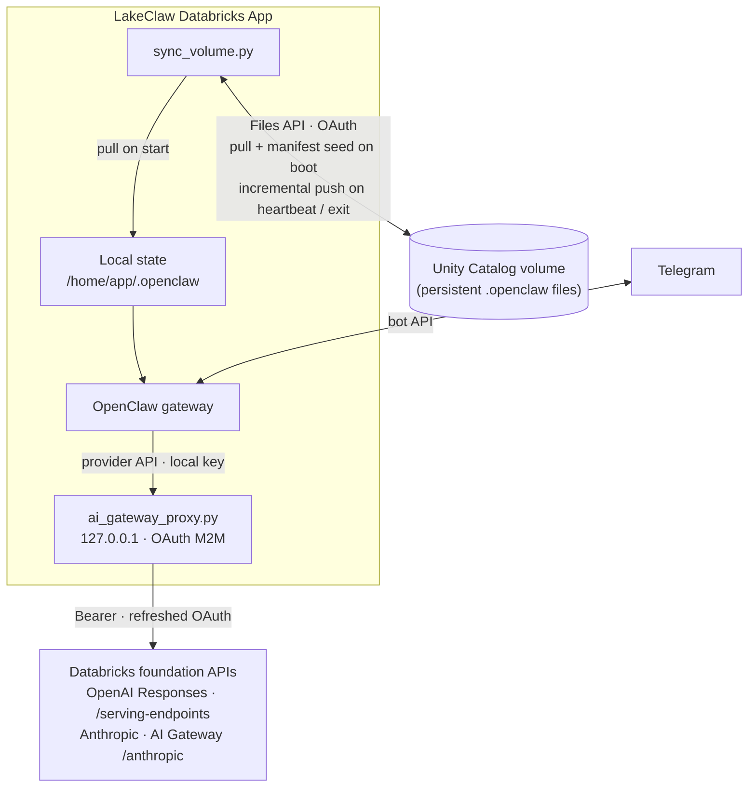

# LakeClaw

Run [OpenClaw](https://github.com/openclaw) on [Databricks Apps](https://docs.databricks.com/en/dev-tools/databricks-apps/index.html): a persistent lakehouse agent with Telegram, Unity Catalog–backed state, and Databricks foundation models via a local OAuth proxy.

The app runs entirely inside a Databricks App; chat reaches the OpenClaw gateway, models go through OAuth to workspace serving endpoints and AI Gateway, and OpenClaw state syncs to a Unity Catalog volume.


## Why LakeClaw

- **Lakehouse-native** — Deploy with Databricks Asset Bundles; no separate VM or PAT for model calls in the default path.
- **Persistent agent state** — OpenClaw files live under `/home/app/.openclaw` and **incrementally sync** to a UC volume (pull on boot, push on heartbeat and shutdown) via the Files API and OAuth.
- **Secure model access** — `app/ai_gateway_proxy.py` exposes a loopback proxy so the gateway uses **OAuth M2M** to `/serving-endpoints` and AI Gateway (`/anthropic`), not a long-lived PAT in the app.
- **Telegram-first control** — Bot + allowlisted user ID; gateway auth via Databricks secrets.
- **Clear boot order** — `entrypoint.sh` prepares state → volume pull/manifest → proxy health → `npm start` (OpenClaw gateway on `DATABRICKS_APP_PORT`).

## Table of contents

- [Quick start](#quick-start)
- [Prerequisites](#prerequisites)
- [Architecture](#architecture)
- [Configuration](#configuration)
- [Deploy and operate](#deploy-and-operate)
- [State persistence](#state-persistence)
- [Project structure](#project-structure)
- [Bundle targets](#bundle-targets)
- [Troubleshooting](#troubleshooting)
- [Contributing and license](#contributing-and-license)

## Quick start

Do this **once per workspace** (bundle cannot create secret values for you).

1. **Create a Unity Catalog volume** and note its full path (example: `/Volumes/catalog/schema/lakeclaw_volume`).
2. **Create secrets** in scope `lakeclaw` (or your chosen scope): keys `gateway-passphrase` and `telegram-bot-token` (see [Configuration](#configuration)).
3. **Set your Telegram user ID** in `app.yaml`: replace `YOUR_TELEGRAM_USER_ID` under `TELEGRAM_ALLOWED_USER_ID` with your numeric ID (e.g. from [@userinfobot](https://t.me/userinfobot)).
4. **Point the bundle at your volume** — set `lakeclaw_volume` in `databricks.yml` **or** pass `-var` on deploy.

From the repo root:

```bash
databricks bundle validate && databricks bundle deploy && databricks bundle run lakeclaw_app
```

Override the volume without editing `databricks.yml`:

```bash
databricks bundle validate && databricks bundle deploy -var='lakeclaw_volume=/Volumes/my_catalog/my_schema/lakeclaw_volume' && databricks bundle run lakeclaw_app
```

**Important:** `databricks bundle deploy` registers the app; **`databricks bundle run lakeclaw_app`** starts it. Logs: `databricks apps logs lakeclaw-dev` (use `lakeclaw-prod` after `databricks bundle deploy -t prod`).

## Prerequisites

- **[Databricks CLI](https://docs.databricks.com/dev-tools/cli/index.html) 0.200+** with bundle support. Run `databricks auth login` (or use a profile) against a workspace with **Databricks Apps** enabled.
- A **Unity Catalog volume** for OpenClaw state (empty is fine) and **WRITE** for the **app service principal** (the OAuth identity used by `app/sync_volume.py`). Grant access after you know the principal if needed.
- A **secret scope** (default `lakeclaw`, overridable via `secret_scope` in `databricks.yml`) with the keys listed in [Configuration](#configuration).
- **Network access** from the app to **`DATABRICKS_HOST`** for **`/serving-endpoints`** and **AI Gateway** (Anthropic paths). See [OpenAI Responses on Databricks](https://docs.databricks.com/aws/en/machine-learning/model-serving/query-openai-responses).
- **OAuth environment** for the app: `DATABRICKS_HOST`, `DATABRICKS_CLIENT_ID`, `DATABRICKS_CLIENT_SECRET` (usually injected by Apps; configure the app identity if not).

## Architecture

Chat flows through the OpenClaw gateway to **`app/ai_gateway_proxy.py`** (loopback). Model traffic uses OAuth M2M to **`/serving-endpoints`** and **AI Gateway** (`/anthropic`). **`app/sync_volume.py`** uses the UC Files API (OAuth): on boot it **pulls** the volume into `/home/app`, then **seeds** a local manifest so uploads know the post-pull baseline. **Push** runs on a timer and on shutdown and uploads **only files whose content changed** (fingerprints in `/home/app/.lakeclaw_push_manifest.json`). If `MY_UC_VOLUME_PATH` is unset, pull is skipped and the manifest is still seeded from local disk.



**Boot order:** `app/entrypoint.sh` prepares the state dir and config symlink → **`sync_volume.py`** (pull from UC when `MY_UC_VOLUME_PATH` is set, then seed push manifest) → **`ai_gateway_proxy.py`** (until `/healthz`) → **`npm start`** (gateway on `DATABRICKS_APP_PORT`). For auth and model routing details, read `app/ai_gateway_proxy.py`, `app/openclaw.json`, and `app/entrypoint.sh`.

## Configuration

### Secret scope (one-time)

```bash
databricks secrets create-scope lakeclaw
databricks secrets put-secret lakeclaw gateway-passphrase
databricks secrets put-secret lakeclaw telegram-bot-token
```

| Secret key | Role |
| ---------- | ---- |
| `gateway-passphrase` | Becomes `OPENCLAW_GATEWAY_TOKEN` (gateway HTTP auth; aligns with `app/openclaw.json`). |
| `telegram-bot-token` | `TELEGRAM_BOT_TOKEN`. |

The app does not rely on a workspace PAT for models: **`ai_gateway_proxy.py`** uses OAuth, and **`sync_volume.py`** uses OAuth for the Files API.

### Bundle variables

Set in `databricks.yml` or with `-var` on deploy:

| Variable | Default | Purpose |
| -------- | ------- | ------- |
| `secret_scope` | `lakeclaw` | Databricks secret scope name bound to the app. |
| `lakeclaw_volume` | `/Volumes/catalog/schema/lakeclaw_volume` | UC volume full path; must exist and allow the app identity to write. |

Example:

```bash
databricks bundle deploy -var='lakeclaw_volume=/Volumes/my_catalog/my_schema/lakeclaw_volume'
```

### App environment (`app.yaml`)

**Injected by the Apps runtime** (do not set manually in `app.yaml`): `DATABRICKS_HOST`, `DATABRICKS_CLIENT_ID`, `DATABRICKS_CLIENT_SECRET`, `DATABRICKS_WORKSPACE_ID`, `DATABRICKS_APP_PORT`. **`AI_GATEWAY_PROXY_LOCAL_KEY`** is generated in `app/entrypoint.sh` if unset.

Secrets and volume bindings reference the bundle resources defined in `databricks.yml`.

## Deploy and operate

| Action | Command |
| ------ | ------- |
| Validate | `databricks bundle validate` |
| Deploy (default `dev` target) | `databricks bundle deploy` |
| Deploy production | `databricks bundle deploy -t prod` |
| **Start app** (after deploy) | `databricks bundle run lakeclaw_app` |
| Logs | `databricks apps logs lakeclaw-dev` or `lakeclaw-prod` |
| Tear down | `databricks bundle destroy` |

## State persistence

OpenClaw state lives under `/home/app/.openclaw` (`OPENCLAW_STATE_DIR`). The bound UC volume path is `MY_UC_VOLUME_PATH` (from the bundle volume binding in `app.yaml`). Incremental push state lives in **`/home/app/.lakeclaw_push_manifest.json`** (outside `.openclaw`, so it is not uploaded to UC).

- **Startup** — `app/sync_volume.py` pulls from the volume into `/home/app` when `MY_UC_VOLUME_PATH` is set, then **seeds** the push manifest from eligible local files so the next push does not re-upload unchanged bytes.
- **Ongoing** — `app/entrypoint.sh` runs a periodic push; **shutdown** runs a final push. Each push compares `mtime_ns` and `size` to the manifest, uploads only when changed (or new), then updates the manifest; deleted local files drop manifest entries.
- **Push scope** — Files under `.openclaw` with extensions `.md`, `.json`, `.jsonl`, `.db`, `.key`, `.yaml`. Skips `openclaw.json` and symlinks so the bundled config is not written back as file content.
- **OAuth vs PAT in Apps** — `WorkspaceClient` is constructed with OAuth; if the runtime also sets `DATABRICKS_TOKEN`, the script temporarily removes it during client init so the SDK does not reject multiple auth methods.

Model transport and Gemini path behavior are defined in `app/openclaw.json` and `app/ai_gateway_proxy.py`.

## Project structure

```
lakeclaw/
├── databricks.yml              # Bundle: app resource, secrets, UC volume, targets
├── app.yaml                    # Command + env → secrets / volume
├── package.json                # openclaw CLI; gateway uses DATABRICKS_APP_PORT
├── requirements.txt
└── app/
    ├── entrypoint.sh           # State dir, pull, proxy, heartbeat, gateway
    ├── openclaw.json           # Models, Telegram, gateway, skills
    ├── ai_gateway_proxy.py     # Loopback OAuth proxy → serving-endpoints / AI Gateway
    ├── sync_volume.py          # UC Files API pull; incremental push + manifest for .openclaw
    └── assets/
        └── lakeclaw-lakehouse-no-bg.png
```

## Bundle targets

| Target | Mode | App name | Notes |
| ------ | ---- | -------- | ----- |
| `dev` | development | `lakeclaw-dev` | Default |
| `prod` | production | `lakeclaw-prod` | `databricks.yml` grants `CAN_MANAGE` to `${DATABRICKS_CLIENT_ID}` for the prod block — set in your deploy environment when using it. |

## Troubleshooting

| Symptom | What to check |
| ------- | ------------- |
| **App starts but Telegram does nothing** | Confirm `TELEGRAM_ALLOWED_USER_ID` in `app.yaml` is your real numeric user ID (not the placeholder), redeploy, and verify `telegram-bot-token` in the secret scope. |
| **Volume sync errors or empty state after restart** | Ensure `lakeclaw_volume` matches an existing volume and the **app service principal** has **WRITE_VOLUME** (or equivalent) on that volume. |
| **Model or proxy failures** | Confirm the workspace allows **serving endpoints** and **AI Gateway** from the app’s network context; verify `DATABRICKS_HOST` / OAuth env vars are present. If the SDK reports multiple auth methods, see the note about `DATABRICKS_TOKEN` in [State persistence](#state-persistence). |

## Contributing and license

Issues and pull requests are welcome. Keep changes focused; match existing layout and naming in `app/` and bundle files.

Add a **`LICENSE`** file in the repository root if you intend others to reuse or redistribute this code; until then, all rights are reserved unless you state otherwise.
